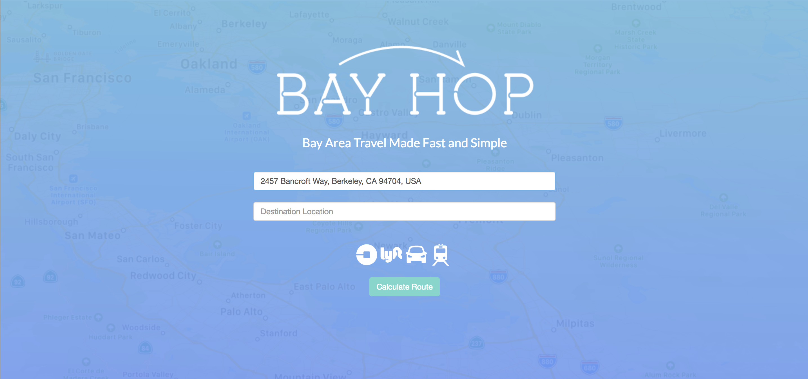
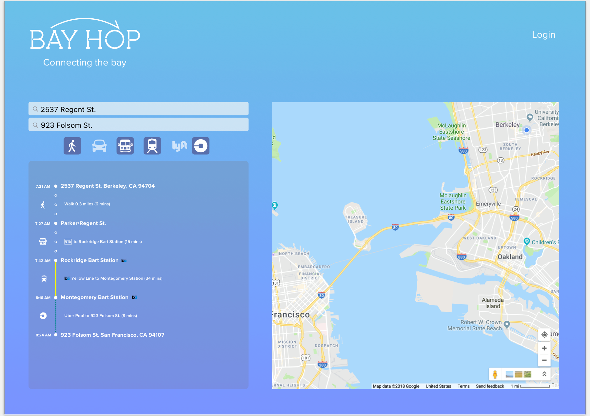

# Bay Hop
Intermodal routing application to optimize travel time in the SF Bay Area through the combination of all modes of tranportation (Cal Hacks 2018)

## Acknowledgments

* Google Maps API
* Uber API
* Lyft API
* Here API
* BART API